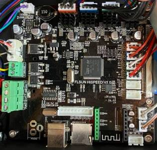
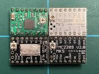
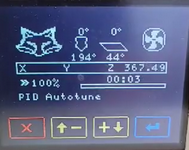
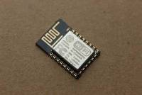
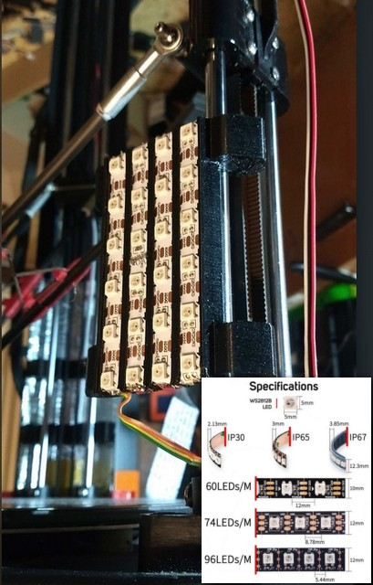

## 1.1. Last news Marlin 2.0.9 and Bugfix Branch 2.0.x

[Official Release Marlin-2.0.9.1 (20210724)](https://github.com/Foxies-CSTL/Marlin_2.0.x/releases)
- Release Marlin 2.0.9.1
- Last stable sources for Delta printer QQS/Q5 branch FLSUN.
- Capability to enable StallGuard2 function (Only TMC2209)
- Wiki work in progress...

## 1.2. Validate and Actived parts
### Validate:
  - Firmware for QQS-Pro/Q5 with A4988/TMC220x_Standalone/TMC220x_UART/TMC2209_UART one-wire.
  - Some families of boards like SKR13/14/14T and MKS Nanov1/v2/v3.

 With activate parts: 

  * [EDIT_MENUS](7.TIPS#711-menus)
  * [NATIVE_LANGUAGE]
  * [HOTEND_IDLE_TIMEOUT]
  * [PROBE_OFFSET_WIZARD](2.SETTINGS-THE-PRINTER#22-z_offset)
  * [DELTA_CALIBRATION_MENU](2.SETTINGS-THE-PRINTER#21-delta-calibration)
  * [AUTO_BED_LEVELING_UBL](2.SETTINGS-THE-PRINTER#23bed-levelling)
  * [UBL_WIZARD](2.SETTINGS-THE-PRINTER#23Bed-Levelling)
  * [MULTI_BUILD_MESH]
  * [UBL_HILBERT_CURVE]
  * [PREHEAT_LEVELING]
  * [POWER_LOSS_RECOVERY]
  * [FILAMENT_RUNOUT_SENSOR]
  * [XY_FREQUENCY_LIMIT]
  * [BABYSTEPPING]
  * [PAUSE_BEFORE_DEPLOY_STOW]
  * [LIN_ADVANCE](7.TIPS#713-hardware)
  * [ARC_SUPPORT]
  * [BINARY_FILE_TRANSFER]
  * [MEATPACK]
  * [STALLGUARD2](3.SPECIAL-MODS#32-tmc2209-single-wire-and-stallguard2)
  * [UART_MODE_for_TMC/RPI/ESP]

## 1.3. **Hardware for the FLSunQ printers**
  
### 1.3.1 MotherBoards QQSP (STOCK Firmware = SCWTPULRM-Robin_mini.bin)
  
  Link to firmwares: [HiSpeedv1_&_RobinMini](https://github.com/Foxies-CSTL/Marlin_2.0.x/tree/Firmwares/QQSP)
  
  With integrated stepper drivers(A4988)=>(**SC.....-Robin_mini.bin**)

  
  
  With removable stepper drivers.
  2&3_A4988(Green/Red)=>(**SC.....-Robin_mini.bin**)
  
   
  
  4xTMC2208 MKS =>(**8C....-Robin_mini.bin**)
  
  
  

### 1.3.2 MotherBoards Q5 (STOCK Firmware = Q5_8+SCTPULRM-Robin_mini.bin)

  Link to firmwares: [NANOv1.2](https://github.com/Foxies-CSTL/Marlin_2.0.x/tree/Firmwares/Q5)=>(**Q5_Header-Robin_nano.bin**)

  
    
### 1.3.3 Others MotherBoards

  Link to firmwares: [SKR](https://github.com/Foxies-CSTL/Marlin_2.0.x/tree/Firmwares/QQS_SKR)=>(**Header-Board-firmware.bin**)
  
   
  

### 1.3.4 Others hardwares

Typically the probe for the QQS-Pro printers.

* Z Probe Offset (-16.2mm)        

  

  [You can also find another template to build and print](https://www.thingiverse.com/thing:4826765)

* Others Micro Steppinp Drivers

  

  White, black or brown for TMC220x.
  Green or red for A4988.  

* TFT screen color Marlin
  - Screen CLASSIC LCD (option "F")

  

  - Screen COLOR TFT (option "C") 
  
   

  

###  Optionals:

  * Modules Wifi (option "W")
  
    
    

  * Led Strip with additional converter 24v/12-5v (option "N")
  
    

  No validate:
  -TMC5121
  -TMC2224/5

***
🚸[Go_To_Home](Home)                                   🚸[Go_To_Index](_Sidebar)
***