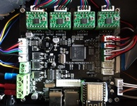
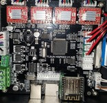
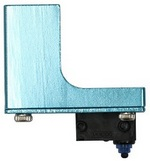

## 1.1. Last news Marlin 2 Bugfix Branch
  Update Marlin-BugFix 20210404
  - New bootscreen ;-)
  - New **Special Menu** to set its Delta and leveling.
  - Update ReadMe.
  - Last fix by Marlin.
  - New release (binaries and source) v1.2.0
  - Support QQSP/Q5 Stock, TMC and UART mode.
  - **All QQSP features on Q5 and SKR**

## 1.2. Validate and Actived parts
### Validate:
  - Firmware for QQS-Pro with A4988/TMC220x_Standalone/TMC220x_UART/TMC2209_UART one-wire.

 With activate parts: 

  * [PID_EDIT_MENU](SETTINGS-THE-PRINTER#)
  * [NATIVE_LANGUAGE]
  * [PROBE_OFFSET_WIZARD](SETTINGS-THE-PRINTER)
  * [DELTA_CALIBRATION_MENU](SETTINGS-THE-PRINTER#21-delta-calibration)
  * [AUTO_BED_LEVELING_UBL](SETTINGS-THE-PRINTER)
  * [UBL_WIZARD]
  * [MULTI_BUILD_MESH]
  * [UBL_HILBERT_CURVE]
  * [PREHEAT_LEVELING]
  * [POWER_LOSS_RECOVERY]
  * [FILAMENT_RUNOUT_SENSOR]
  * [XY_FREQUENCY_LIMIT]
  * [BABYSTEPPING]
  * [PAUSE_BEFORE_DEPLOY_STOW](SETTINGS-THE-PRINTER)
  * [LIN_ADVANCE]
  * [ARC_SUPPORT]
  * [BINARY_FILE_TRANSFER]
  * [UART_MODE_for_TMC/RPI/ESP]

## 1.3. **Hardware for the FLSunQ printers**
  
  # 1.3.1 MotherBoards QQS(P): 
    [HiSpeedv1_&_RobinMini](https://github.com/Foxies-CSTL/Marlin_2.0.x/tree/Firmwares/QQSP)
    
    With integrated stepper drivers(A4988)=>(**Sxxx-Robin_mini.bin**)

    
    
    With removable stepper drivers.
    2&3_A4988(Green/Red)=>(**Sxxx-Robin_mini.bin**)
    
     
    
    4xTMC2208 MKS =>(**8xxx-Robin_mini.bin**)
    
    
  
  * Others Micro Steppinp Drivers
  
    

  # 1.3.2 Other MotherBoards for Q5:

    [NANOv1.2](https://github.com/Foxies-CSTL/Marlin_2.0.x/tree/Firmwares/Q5)=>(**Q5_Header_robin_nano.bin**)

    
    
  # 1.3.3  [SKR](https://github.com/Foxies-CSTL/Marlin_2.0.x/tree/Firmwares/QQS_SKR)=>(**Header-firmware.bin**)
    
     
    

  Typically the probe for the QQS-Pro printers.
  
  * Z Probe Offset (-16.2mm)        * TFT screen color Marlin

            
  

###  Optionals:

  * Modules Wifi
  
    
    

  * Led Strip with additional converter 24v/12-5v
  
    

  No validate:
  -TMC5121
  -TMC2224/5

***
[Go_To_Home](Home)                                   [Go_To_Index](_Sidebar)