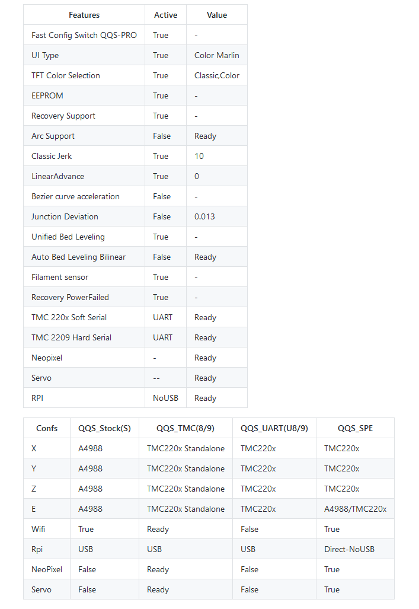
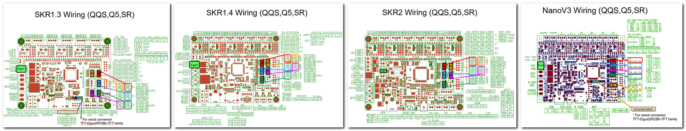

## 1.1 Last news Marlin 2.1.0 and Bugfix Branch 2.1.x

 [Official Release Marlin](https://github.com/Foxies-CSTL/Marlin_2.1.x/releases)
  - All features from the latest version of Marlin ([News](https://github.com/MarlinFirmware/Marlin/releases/tag/2.1))
  - Ready for MPC function instead PID nozzle.
  - Temperature Model Predictive Control ([MPC](https://marlinfw.org/docs/features/model_predictive_control.html))
  - Reorganization of the "Special Delta" menu 
  - Set 32Steps for MoBo with TMC mode UART
  - Sensorless homing tweak
  - Rewrite config file (FLSUNQ_Config.h) to add options HotEndAllMetal/MPC/Buffers hosts/...
  - Ready for TFT Screen Mks-TS35Rv2(SR), Btt-TFT35v3(SR),Mks-TFT35v1(QQSP/Q5)
  - option to use MKS H43 screen (DWIN) (QQSP/Q5/SR)

## 1.2 Validate and Actived parts
  ### Validate:
  - Firmware for "QQS-Pro" with A4988/TMC220x_Standalone/TMC220x_UART/TMC2209_UART one-wire.
  - Firmware for "Q5v1.2" and "Q5v1.3" with A4988/TMC220x_Standalone/TMC220x_UART.
  - Firmware for "SR" with TMC2209_UART and both motherBoard (Mks/Btt).
  - Some families of boards like SKR13/14/14T/2.0b and MKS Nanov1/v2/v3.

 With activate parts: 

  * [EDIT_MENUS](7.TIPS#711-menus)
  * [NATIVE_LANGUAGE]
  * [HOTEND_IDLE_TIMEOUT]
  * [AUTO_OFF_SCREEN]
  * [MODEL_PREDICTIVE_CONTROL]
  * [PROBE_OFFSET_WIZARD](2.SETTINGS-THE-PRINTER#22-z_offset)
  * [DELTA_CALIBRATION_MENU](2.SETTINGS-THE-PRINTER#21-delta-calibration)
  * [AUTO_BED_LEVELING_UBL](2.SETTINGS-THE-PRINTER#23bed-levelling)
  * [UBL_WIZARD](2.SETTINGS-THE-PRINTER#23Bed-Levelling)
  * [MULTI_BUILD_MESH]
  * [UBL_HILBERT_CURVE]
  * [TEST_PRINT_PATTERN]
  * [PREHEAT_LEVELING]
  * [POWER_LOSS_RECOVERY]
  * [FILAMENT_RUNOUT_SENSOR]
  * [XY_FREQUENCY_LIMIT]
  * [BABYSTEPPING]
  * [PAUSE_BEFORE_DEPLOY_STOW]
  * [LIN_ADVANCE](7.TIPS#713-hardware)
  * [ARC_SUPPORT]
  * [BINARY_FILE_TRANSFER]
  * [MEATPACK]
  * [STALLGUARD2](3.SPECIAL-MODS#32-tmc2209-single-wire-and-stallguard2)
  * [UART_MODE_for_TMC/RPI/ESP]

## 1.3 **Hardware for the FLSunQ printers**
  
  ### 1.3.1 MotherBoards_QQSP 
   **(STOCK Firmware Marlin =  QQSP_STOCK-Robin_mini.bin or SCWTPULRM-Robin_mini.bin)**
  
   Link to firmwares: [HiSpeedv1_&_RobinMini](https://github.com/Foxies-CSTL/Marlin_2.1.x/tree/Firmwares/QQSP)
  
   With integrated stepper drivers(A4988)=>(**SC.....-Robin_mini.bin**)

   
  
   With removable stepper drivers.
   2&3_A4988(Green/Red)=>(**SC.....-Robin_mini.bin**)
  
    
  
   4xTMC2208_standalone MKS =>(**QQSP_STOCK_TMC8-Robin_mini.bin or 8C....-Robin_mini.bin**)
  
   

   New version of HiSpeedv1 with a new chip (**GD32F303VET6**)
   
   **You have to rename the firmware name to "Robin_nano.bin" instead of "Robin_mini.bin".**

   
  
  ### 1.3.2 MotherBoards_Q5 
   **(STOCK Firmware Marlin = Q5_STOCK-Robin_nano.bin or Q5_8+SCTPULR-Robin_mini.bin)**

   Link to firmwares: [NANOv1.2/1.3](https://github.com/Foxies-CSTL/Marlin_2.1.x/tree/Firmwares/Q5)=>(**Q5_Header-Robin_nano.bin**)

   
    
  ### 1.3.3 MotherBoards_SR
   **(Firmware+Other TFT = SRB_SrBPULR-firmware.bin)**

   **(Firmware+Other TFT = SRM_SrBPULR-Robin_nano_v3.bin)**

   **Note**: Here are the two screens that work with my firmwares,
  
   BTT-TFT35v3 Option "r" 

   MKS-TS35R Option "C" 

   Link to firmwares: [Btt-SKR13](https://github.com/Foxies-CSTL/Marlin_2.1.x/tree/Firmwares/SR)=>(**SRB_Header-firmware.bin**)

   

   Link to firmwares: [Mks-NANOv3.0](https://github.com/Foxies-CSTL/Marlin_2.1.x/tree/Firmwares/SR)=>(**SRM_Header-Robin_nano_v3.bin**)

   

  ### 1.3.4 Others MotherBoards

   Link to firmwares: [MKS](https://github.com/Foxies-CSTL/Marlin_2.1.x/tree/Firmwares/MoBo_MKS)=>

   Link to firmwares: [BTT](https://github.com/Foxies-CSTL/Marlin_2.1.x/tree/Firmwares/MoBo_SKR)=>(**Header-Board-firmware.bin**)
  
    
   
   ### NEW WIRING
  
   

   Link to wiring diagram: 
   - [SKR13](./images/SKR13_EndStop.png)
   - [SKR14](./images/SKR14_EndStop.png)
   - [SKR2](./images/SKR2_EndStop.png)
   - [NanoV3](./images/NanoV3-EndStop.png)

  ### 1.3.5 Others hardwares

   Typically the probe for the QQS-Pro printers.

   * Z Probe Offset (-16.2mm)        

   

   ## **You can also find another template to** [print](https://www.thingiverse.com/thing:4826765) or to [build](https://github.com/JDHProductions/Probe-Board).

   * Other stepper motor drivers

   

   White, black or brown for TMC220x.
   Green or red for A4988.  

   * TFT screen color Marlin
   - Screen CLASSIC LCD (option "F")

   

   - Screen COLOR TFT (option "C") 
  
    

   - Screen Color BTT-TFT (option "r")

   

   - Spécial Menu Delta (Marlin COLOR and BTT TOUCH)
  
   

   

   ###  Optionals:

   * Modules Wifi (option "W/w")
  
   
   

   * Led Strip (NeoPixel) with additional converter 24v/12-5v (option "n")
  
   

   No validate:
   -TMC5121

***
🚸[Go_To_Home](Home)                                   🚸[Go_To_Index](_Sidebar)
***