  ### HELP - PROCEDURE - TIPS 
  After the flash, you must **RESET** your **QQS, Q5, SR** printer!!
  
  
    
  By "Special Delta" menu.
  - do the first item.

  By menu:
  - "Configuration/AdvancedSettings/InitializeEEPROM"

  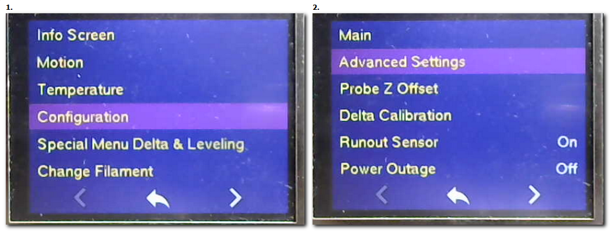

  By terminal:
  - with the command "M502" (Factory Reset), then "M501" (restore default) and "M500" (Save settings in EEPROM).
  
   # **VERY IMPORTANT:**
   First of all, you need to check that you have flashed the **correct firmware**.
   To do this, with a finger on the power switch ⚡️, obtain a "HOME" from the menu (Motion/AutoHome) or a "G28" command from a terminal.

    📺 Note for Q5 & QQS & SR 📺: 
    After the flash, you may be asked to calibrate the screen: 
    press the crosses on the screen (4 times) to complete the calibration.
    The home screen is displayed after 10/15 seconds. 
    This GCode command "M995" to redo a calibration screen.

  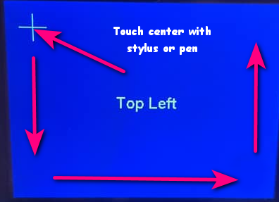
  
  ## **Now YOU are ready to start a calibration of your printer!!**
  
    🔧 Note for the probe 🔧:
    During the various Delta Calibration, Wizard Z_Probe and Leveling procedures, 
    the printer will ask you to deploy the probe or stow the probe.
    This indicates that you need to physically plug in/out the probe
    and press at the bottom of the screen (status message) to confirm your action.

   #✨**NEW SINCE APRIL 2021 :**

   NOW YOU HAVE A **DEDICATED MENU** TO DO THE DIFFERENT STEPS OF THE PREPARATION OF YOUR PRINTER!
 
   THEY ARE POSITIONED IN THE ORDER OF THE OPERATIONS TO BE CARRIED OUT.

  - UI Marlin COLOR

    

   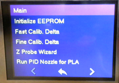
  
  - UI TOUCH by BTT

   
   
## 2.1 Delta Calibration
  ###  **Perform a Delta Calibration:**
  
  Use the "Special Delta Prepare" menu to run a quick calibration (Fast) or a high calibration (Fine).

   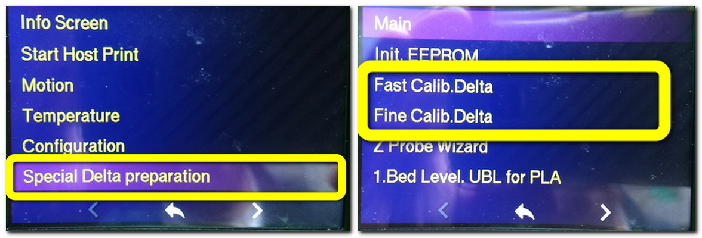

  By menu:
  - Use the menu **"Special Delta"** to do a Fast or Fine calibration. 
  - or this way "Configuration/Delta_Calibration/AutoCalibration"(5/8 iterations).
  - Note: The bed is heated to 60°C (default) before the start of the calibration.

  By terminal:

  **📌Tip** Via a terminal like Pronterface, Octoprint, Repetier, Astroprint, ESP3D, ...: 
        
        After a Delta calibration (G33 v3) if you get a "std dev:" sup.> 0.2, 
        it means that you have a problem with the structure of your printer!
        A "std dev:" of 0.04 and less is excellent !! standard is 0.06 (QQS),0.015(SR).
  
  - with the command "G33" or G33 V3 (5/8 iterations).
  - Note: The bed is heated to 60°C (default) before the start of the calibration.

  Now, you need to redo/adjust the Z offset (Space between the nozzle and the bed=Real dimension of your probe).
  
## 2.2 Z_OffSet
  ###  **Perform a Z offset:**

  📌✨New procedure with the last firmware (Since April 2021)!!
    Use the menu **"Special Delta"** to launch the wizard.

  By menu: 

  - Before starting the wizard (<Marlin 2.0.9.2), go to **"Motion/MoveAxis" and disable the endstops.** 
   
   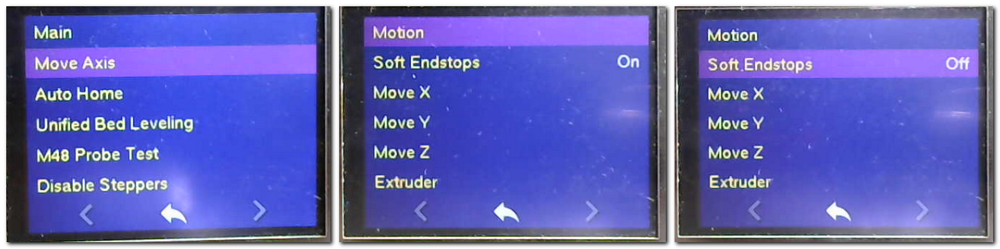

  - Lauch the ZOffSet wizard:

   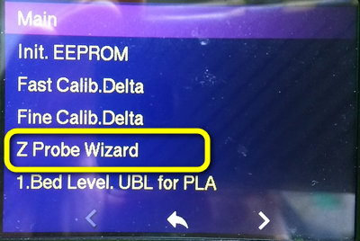

   📌Note: 

  After run the "ZProbe Wizard", it makes a "HOME" and asks you to put the probe on
  (touch the bottom of the screen to confirm), heats the bed to 60°C and makes a single probing. After that, it asks you to remove the probe (touch the bottom of the screen to confirm) and it is up to you, by choosing the displacement scales. Use the panel control to carefully move the nozzle towards the bed. 
  
  By Marlin menu:

  "Configuration/Advanced_Settings/Probe_Offset/Z_Probe_Wizard"
  
  - Note: The bed is heated to 60°C (default) before starting and follow the instructions at the bottom of the screen.

   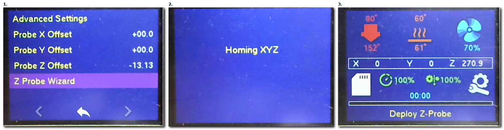    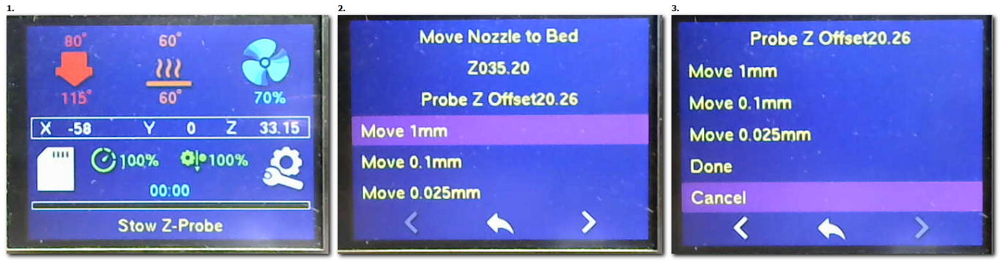
  
  Adjust the gap between the nozzle and the bed using a piece of paper and the fine controls (0.01/0.025mm). 
  When you can remove the paper without tearing it, you are fine. 
  You must validate the operation by pressing the **"Done"** line and not the arrow at the bottom of the screen, or "Cancel" to redo the procedure.

  View the value on the display and check the value in the Configuration/Probe_ZOffset" (Value between -20.00 and -13.00) 
  
  - Finally store the parameters "Configuration/StoreSettings".  

   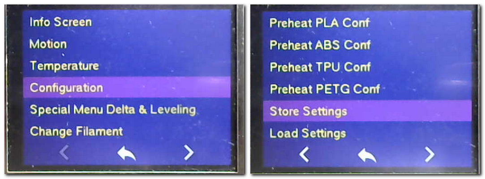

  By BTT menu:
  - Enter Menu/prepare/bed level/P_Offset

  By terminal: 
  - deactivating the endstops with command M211 S0 =>read result in console.
  - Use the terminal's control panel to carefully move the nozzle towards the bed. Adjust the gap between the nozzle and the bed using a piece of paper and the fine controls (0.01/0.025mm). When you can remove the paper without tearing it, you are fine.
  - View the value on the display and enter the value in the Probe_Z_Offset with command "M851 Z-xx.xx"
  - finally store the parameters with command "M500".
  - Control your result of operations by command "M503".

**📌TIPS-BABYSTEPPING**

To adjust or refine your ideal layer height, you can use the BABYSTEPPING function during the first few lines of printing. To do this you have three methods available:  
  - By double tapping on the screen: once on the "Gear" icon and then a second time on the "status info" line quickly. You get the adjustment screen.
  - By tapping on the center bar "X.. Y...Z... "You get the movement screen where only the "Z_OffSet" adjustment is available.
  - By tapping on the "Gear" icon and then the "Tune/Probe Z_OffSet" menu.  
## 2.3 🥅Bed Levelling
  ###  **Perform a bed calibration ([**UBL**](https://marlinfw.org/docs/features/unified_bed_leveling.html))** (option "U")

  - ✨New procedure with the last firmware (Since April 2021)!!  
    Use the menu **"Special Delta"** to run your prefer leveling (PLA, PETG, ABS) with **auto-save**.

   **Remember:** the command G28 activates the leveling and loads the last used or stored leveling.

  

   **📌Note:** When you do your different leveling, these levelings are automatically stored in slots. 
        You have slots available (4 for QQS/Q5, 12 for SR) for different meshes at different bed temperatures. 
        By convention on my firmware the first one (default) is 0 , 1 for PLA, 2 for PETG, 3 for ABS (menu order) and one free for the user.
        When you cut your object for PLA or PETG, you have to load this memorized leveling by commanding **G29 Lx** in the startup GCode of your slicer.

   **Other method:**       
  
  - Go to "Motion" menu to use a UBL wizard to build your mesh (>Marlin 2.0.8).    

  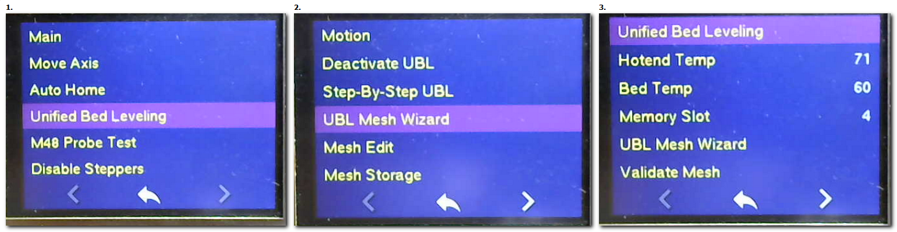
  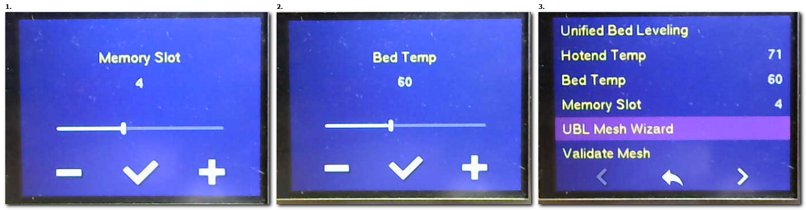
  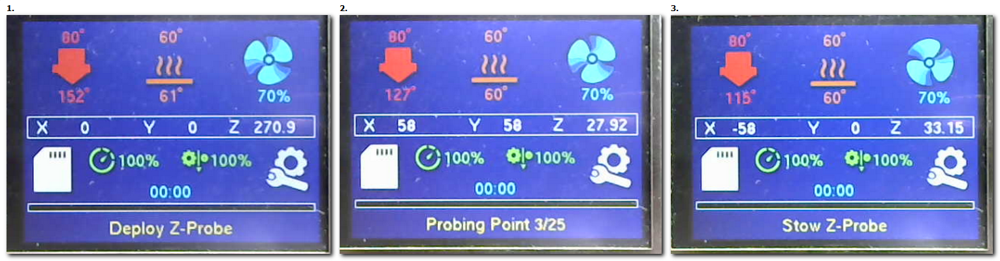

  **📌Note:**
     The leveling of the mesh bed is based on the SQUARE and we have a CIRCLE so we will always be missing inaccessible points. That's why we fill these points with values identical to the closest values of these points.

  

  By terminal with the commands:
  - M190 S60 (temp bed at 60° or other)
  - G28 (autohome)
  - G29 P1 (automated probing of the bed)
  - G29 P3 T (Repeat until all mesh points are filled in)
  - G29 P3 T (bis)
  - G29 T (View the Z compensation values)
  - G29 S0 (Save UBL mesh points to EEPROM in the default location 0 )
  - G29 F10 (Set Fade Height for correction at 10 mm)
  - G29 A (Activate the UBL System)
  - M500 (Save to EEPROM)
  - M140 S0 (Stop temp bed)
  
  By Marlin menu:
  - Put your bed at working temperature.
  - Enter Motion/UnifiedBedLeveling/UBL_Tools/Build Mesh/BuildColdMesh to run a leveling.
  - you have a preheating of the bed to 60°C and the beginning of the leveling.
  
  By BTT menu:
  - Enter Menu/prepare/bed level/ to run a leveling and save to location choice.

  ###  **Perform a bed calibration ([**ALB**](https://marlinfw.org/docs/features/auto_bed_leveling.html))** (option "A")
  
  By terminal:
  - with the command "G29"

  By Marlin menu:
  - Put your bed at working temperature.
  - Go to "Configuration/Levelling"

 If you later notice that the dimensions of your printed objects are inaccurate then 
    it will be necessary to carry out a final calibration of your turns by printing an object
    to correct these errors.

## 2.4 DIMENSIONS
  ### **Perform or correct by calculation (worksheet) the adjustment of your dimensions:**
  - To adjust the x, y, z precision, you first need a well-stabilized machine, 
  - ie being able to print on a well-leveled plate. Then by printing this model: [Advanced Delta Printer Calibration](https://www.thingiverse.com/thing:745523)
  - you adjust the DELTA_DIAGONAL_ROD (L) and the lengths DIAGONAL_ROD_TRIM_TOWER (ABC) between the laps by calculation (xls or [odt file](./menus/Simple_Delta_Calibration.ods)) and you insert them all the parameters to be modified with this command **[M665](https://marlinfw.org/docs/gcode/M665.html) Lxx Axx Bxx Cxx**.

  

  - If you print the model again you should find a very small difference (0.1/0.09) on XYZ.
  - I prefer this model because it fits well with the caliper: [Objet_QuickCalDelta](https://www.thingiverse.com/thing:2256557)

  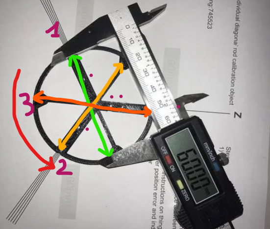

  **Now you can print a torture test and check that your dimensions are correct. Keep in mind that wall and layer values in your slicer also influence these dimensions. It is also related to the physical characteristics of the filament used (PLA vs ABS).**

  📌 Don't forget to stabilize your working temperatures by performing the **PID** of your hotend and adjust your **eSteps** to get a stable and correct filament flow.
  
## 2.5 PID
  [Proportional-Integral-Derivative](https://reprap.org/wiki/PID_Tuning)

 This procedure allows to calibrate the temperature variation of the nozzle and the bed.
 This allows to obtain a stability of heating in order to avoid artifacts or anomalies of the filament during the printing. It is also important to redo when changing the nozzle, heating cartridge and thermistor.

 Tip: You can perform different PIDs to adapt to the filaments you are using because a PID pair (nozzle/bath) for PLA will not be the same as a PID pair for ABS/ASA.

  ### **Perform a nozzle PID or MPC on active extruder:**
  
  - ✨New Option "m" Temperature Model Predictive Control ([MPC](https://marlinfw.org/docs/features/model_predictive_control.html))

  - Use the **"Special Delta "** menu to run a nozzle PID for PLA or other by the other method.

  - Use the **"Special Delta "** menu to run an auto-control on active hotend.

   **Other method:** 

  By the menu: 
  - "Configuration/Advanced Settings/Temperature/PID Autotune E1" and choose your current working temperature (ie: PLA 210, PETG 230, ABS 250) 

  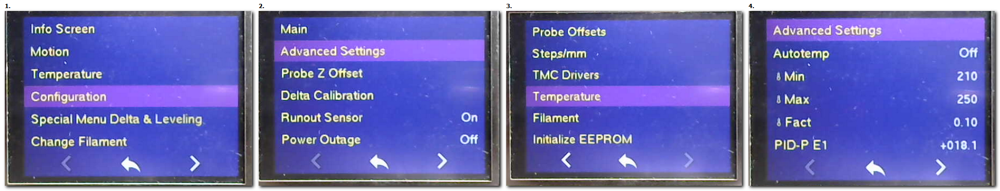  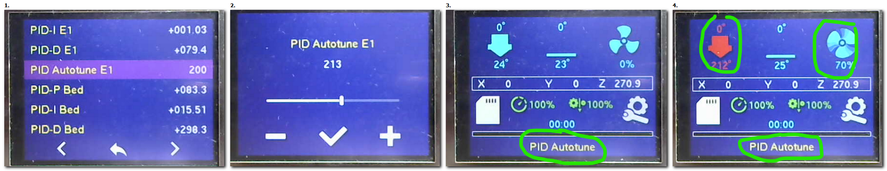
  
  By terminal: 
  - PID = with the command "M303 E0 **S210** C8 U" (ie: S210 for PLA)
  - MPC = M306T or M306 P50 T (for a 50W heating cartridge)
  
  ### **Perform a bed PID:**
  
  By Marlin menu: 
  - "Configuration/Advanced Settings/Temperature/PID Autotune Bed" and choose your current working temperature (ie: PLA 60°C, PETG 80°C, ABS 90°C)  
  
  

  By terminal: 
  - with the command "M303 E-1 **S60** C8 U" (ie: S60 for PLA)
  
## 2.6 EXTRUDER
  (option "T"Titan or "B"Bmg or "X"DirectDrive_Nema14)
  ### **Perform correct adjustment of the steps of your extruder.**

  ie: For the BMG_right(B), I set it to 415 but it's better to confirm it by command "M83" then "G1 E100 F100" which extrudes 100mm of filament.
  
  Preparation:
  - Remove your filament, the Capricorn/PTFE tube coming out of the extruder, introduce the filament into the extruder so that it comes out on the other side. 
  - Measure before extruding 120mm of filament to make a mark.
  
  By terminal:
  - Heat your nozzle to 190°C and run the previous command: "M83" then "G1 E100 F200" 
  - At the end, measure your remainder up to the mark and do rule of three:

        **LengthtoExtrude / LengthExtruded * Actuel_eStep (M92 E_old) = New_eStep (M92 E_new).**
  
  - Put a new value with command M92 Exxx and memorize M500 or "Store Settings"
  
  By Marlin menu (No possibility to adjust start and speed !!):
  - Heat your nozzle to 190°C and go to "Motion/MoveAxis/Extruder/Move 10mm"
  - .......

  By BTT-TFT menu:
  - "Menu/Prepare/Machine/Tuning/extruder steps"

  ### **Perform correct filament flow.**
  - This chapter is being written ...............

  Some tips and filament calibration tests can be found on [Slicer part](4.SLICERS-PART#414-tests) 

***
🚸[Go_To_Home](Home)                                   🚸[Go_To_Index](_Sidebar)
*** 