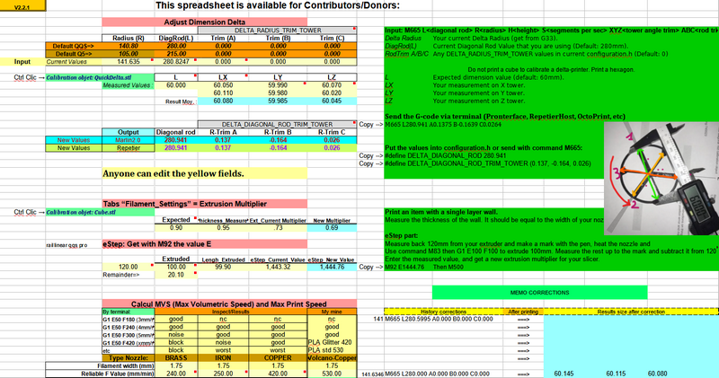

  ### HELP - PROCEDURE - TIPS 
  After the flash, you must **RESET** your printer!!
  
  
  
  By menu:
  - "Configuration/AdvancedSettings/InitializeEEPROM"
  
  By terminal:
  - with the command "M502" (Factory Reset), then "M501" (restore default) and "M500" (Save settings in EEPROM).
  
   # **VERY IMPORTANT:**
   First of all, you need to check that you have flashed the **correct firmware**.
   To do this, with a finger on the power switch :-), obtain a "HOME" from the menu (Motion/AutoHome) or a "G28" command from a terminal.

     Note for Q5: 
     After the flash, you may be asked to calibrate the screen: press the crosses on the screen to complete the calibration.
  
  Now YOU are ready to start a calibration of your printer!!

   # **NEW SINCE APRIL 2021 :**
   NOW YOU HAVE A **DEDICATED MENU** TO DO THE DIFFERENT STEPS OF THE PREPARATION OF YOUR PRINTER! THEY ARE POSITIONED IN THE ORDER OF THE OPERATIONS TO BE CARRIED OUT.

   

   
  
## 2.1. Delta Calibration
###  **Perform a Delta Calibration:**
  
  By menu:
  - Use the menu **"Special Delta"** to do a Fast or Fine calibration. 
  - "Configuration/Delta_Calibration/AutoCalibration"(5/8 iterations).
  
  By terminal:
  - with the command "G33" or G33 V3 (5/8 iterations).
    
  **Tip** Via a terminal like Pronterface, Octoprint, Repetier, Astroprint, ESP3D, ...: 
        
        After a Delta calibration (G33 v3) if you get a "std dev:" sup.> 0.2, 
        it means that you have a problem with the structure of your printer!
        A "std dev:" of 0.04 and less is excellent !! standard is 0.08.
  
  After removing the probe, you need to redo/adjust the Z offset (Space between the nozzle and the bed=Real dimension of your probe).
  
## 2.2. Z_OffSet
###  **Perform a Z offset:**
  
  By menu: 

  - New procedure with the last firmware (Since April 2021)!!
    Use the menu **"Special Delta"** to launch the wizard.

   

       "Motion/MoveAxis" deactived the endstops.
       "Motion/MovesAxis/Move ZThen lower the nozzle slowly to adjust to a sheet of paper.
       View the value on the display and enter the value in the Configuration/ProbeZOffset" (Value between -20.00 and -13.00) 
       finally store the parameters "Configuration/StoreSettings".
  
  By terminal: 
  - deactivating the endstops with command M211 S0 =>read result in console.
  - View the value on the display and enter the value in the Probe_Z_Offset with command "M851 Z-xx.xx"
  - finally store the parameters with command "M500".
  - Control your result of operations by command "M503".
  
## 2.3. Bed Levelling
###  **Perform a bed calibration ([**UBL**](https://marlinfw.org/docs/features/unified_bed_leveling.html))**

  - Add a wizard UBL to build your mesh (Marlin 2.0.8+).
  - New procedure with the last firmware (Since April 2021)!!

    Use the menu **"Special Delta"** to run your prefer leveling (PLA, PETG, ABS) with auto-save.

  
  
  By terminal with the commands:
  - M190 S60 (temp bed at 60° or other)
  - G28 (autohome)
  - G29 P1 (automated probing of the bed)
  - G29 P3 T (Repeat until all mesh points are filled in)
  - G29 P3 T (bis)
  - G29 T (View the Z compensation values)
  - G29 S0 (Save UBL mesh points to EEPROM in the default location 0 )
  - G29 F10 (Set Fade Height for correction at 10 mm)
  - G29 A (Activate the UBL System)
  - M500 (Save to EEPROM)
  - M140 S0 (Stop temp bed)
  
  By menu:
  - Put your bed at working temperature.
  - Enter Motion/UnifiedBedLeveling/UBL_Tools/Build Mesh/BuildColdMesh to run a leveling.
  - you have a preheating of the bed to 60°C and the beginning of the leveling.

  **Note:**
     The leveling of the mesh bed is based on the SQUARE and we have a CIRCLE so we will always be missing inaccessible points. That's why we fill these points with values identical to the closest values of these points.
  
  

###  **Perform a bed calibration ([**ABL**](https://marlinfw.org/docs/features/auto_bed_leveling.html))**
  
  By terminal:
  - with the command "G29"

  By menu:
  - Put your bed at working temperature.
  - "Configuration/Levelling"

  **TIPS-LEVELLING**

    - You have 4 locations: so you can save (G29 Sx) different meshes at different bed temperature
     (ie: 0 for PLA, 1 for PETG, 2 for FLEX, etc. ) and call them back 
     when you slice from the PLA by command G29 L0 in the startGCode* of your filament.
     (*=PrusaSlicer).

    - If you later notice that the dimensions of your printed objects are inaccurate then 
    it will be necessary to carry out a final calibration of your turns by printing an object
    to correct these errors.

  ## 2.4. DIMENSIONS
  ### **Perform or correct by calculation (worksheet) the adjustment of your dimensions:**
  - To adjust the x, y, z precision, you first need a well-stabilized machine, 
  - ie being able to print on a well-leveled plate. Then by printing this model: [Advanced Delta Printer Calibration](https://www.thingiverse.com/thing:745523)
  - you adjust the DELTA_DIAGONAL_ROD (L) and the lengths DIAGONAL_ROD_TRIM_TOWER (ABC) between the laps by calculation (xls or [odt file](https://www.thingiverse.com/thing:1274733)) and you insert them all the parameters to be modified with this command [M665](https://marlinfw.org/docs/gcode/M665.html) Lxx Axx Bxx Cxx.

  

  - If you print the model again you should find a very small difference (0.1/0.09) on XYZ.
  - I prefer this model because it fits well with the caliper:[Objet_QuickCalDelta](https://www.thingiverse.com/thing:2256557)

  
  Remember to adjust your temperatures by doing your **Nozzle PID** and adjust your **eSteps** for stable filament flow.
  
  ## 2.5. PID
  [Proportional-Integral-Derivative](https://reprap.org/wiki/PID_Tuning)

  ### **Perform a nozzle PID:**
  
  - New procedure with the last firmware (Since April 2021)!!

  - Use the **"Special Delta "** menu to run a nozzle PID for PLA or other by the other method.

  By the menu: 
  - "Configuration/Advanced Settings/Temperature/PID Autotune E1" and choose your current working temperature (ie: PLA 210, PETG 230, ABS 250) 
  
  By terminal: 
  - with the command "M303 E0 **S210** C8 U0" (ie: S210 for PLA)
  
  ### **Perform a bed PID:**
  
  By menu: 
  - "Configuration/Advanced Settings/Temperature/PID Autotune Bed" and choose your current working temperature (ie: PLA 60, PETG 80, ABS 90)  
  
  By terminal: 
  - with the command "M303 E-1 **S60** C8 U" (ie: S60 for PLA)
  
  ## 2.6. EXTRUDER
  ### **Perform correct adjustment of the steps of your extruder.**

  ie: For the BMG, I set it to 415 but it's better to confirm it by command "M83" then "G1 E100 F100" which extrudes 100mm of filament.
  
  Preparation:
  - Remove your filament, the Capricorn/PTFE tube coming out of the extruder, introduce the filament into the extruder so that it comes out on the other side. 
  - Measure before extruding 120mm of filament to make a mark.
  
  By terminal:
  - Heat your nozzle to 190°C and run the previous command: "M83" then "G1 E100 F200" 
  - At the end, measure your remainder up to the mark and do rule of three:

        **LengthtoExtrude / LengthExtruded * Actuel_eStep (M92 E_old) = New_eStep (M92 E_new).**
  
  - Put a new value with command M92 Exxx and memorize M500 or "Store Settings"
  
  By menu (No possibility to adjust start and speed !!):
  - Heat your nozzle to 190°C and go to "Motion/MoveAxis/Extruder/Move 10mm"
  - .......

  ### **Perform correct filament flow.**
  - This chapter is being written ...............

[Go_To_Home](Home)                                   [Go_To_Index](_Sidebar)
***  