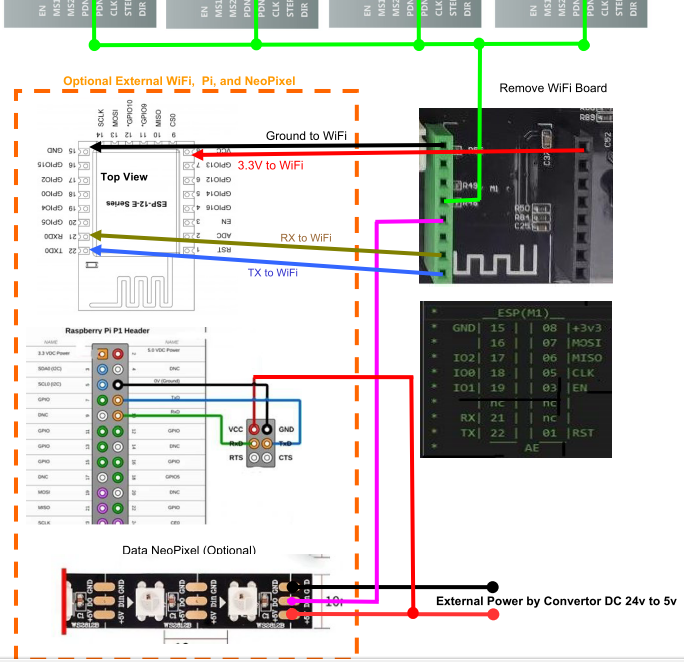

  UART, SINGLE WIRE, STALLGUARD, MECHANICAL, ELECTRONIC, ....
  This chapter is being written ...............

## 3.1 TMC with UART mode

**! ⚡️WARNING⚡️ !** If you are replacing your old ***A4988** stepper drivers with the new **TMC22xxs**, 

🔥REMEMBER TO CHECK the direction🔥 by making sure the "DIR" and "GND" pins on the stepper driver match the pins on your board. 

**! ⚡️WARNING⚡️ !** For the **TMC2209s** with two extra **DIAG/VREF** pins, you must isolate them before connecting them because these pins can touch the capacitor and destroy the stepper driver or the cpu of your board.

  

  - Wiring for UART mode.
    - Wire between Driver Stepper pins (UART) and pins Wifi socket (M1).
      Also remove only the M3 for TMC2208 or all jumper for TMC2209 under the stepper motors and set J11 (QQS) (near the XY stepper motor socket) to 3v3 as the input pins on the Wifi socket are only on 3v3 and all TMCs are 5v/3v3 compatible.
    
      

     
    
  - Control UART mode.
    - You can check their operation, use the M122 command through a terminal. 
    You will find out which one is malfunctioning or working well.
    
    

## 3.2 TMC2209 Single wire and Stallguard2
_(Thanks to Joe B. for this editorial help)_
  - Wiring for UART mode.

    ***⚡️Some Warning⚡️ !!***

    The TMC2209 used are BTT brand with additional pins for on the bottom and top of the 
    component.
    For the pins below (**DIAG/VREF**), you have to be very careful when connecting them 
    because they can touch the capacitor of the board !! The best is to insulate them with 
    thermal sheath.
   
    
   
    - Instructions:
    On the photos of connection to the Wifi socket (M1):
      - Green wire goes to pin PA8 (TMC control)

       

       

      - Purple wire goes to pin PC7 (control of the led strips)
      - Brown wire goes to pin PA9 (Channel Reception Rx)
      - Blue wire goes to pin PA10 (Channel Transmission TX)

    
  - Other adds:

  To control the LEDs, you must activate the option in the firmware and define the number 
  of LEDs. Don't forget to power your led strip with a 24v to 12v or 5v converter.
  On the Tx/Rx you can connect (with ribbon cables) an ESP/MKS_Wifi module or your Raspberry/Octoprint. The BAUDS setting is the same as that of the printer (115200 or 25000).
  You can use M1 socket 3v3 only for MKS wifi module. For another voltage use a 24v to 5v converter with a minimum of 3A if it's a raspberry.

    

  
  - Wiring of the StallGuard function (Option G/g).
    
    Since the end of June 2021, this function allows the use of homing and/or probing without limit switch and without probe. To use this function, a specific firmware is required, but also a wiring between the "DIAG" pin of the TMC and the "SIGNAL" pin of the stop connector. 
    
    The "Homing" function works well after setting the trigger sensitivity of the TMCs, but the "Probing" function is more difficult to implement and to set with boards which do not integrate this function (HiSpeed, NanoV1, ...).
    

## 3.3 Raspberry
  - Improve your Raspberry (Bauds, plugins, Network).
  
    

## 3.4. Various assembly
### Wiring for mounting Esp8266, filament detector, temperature probes, relay control, etc.
  
  1. Module Wifi (ESP or MKS_Wifi):
      - Use a cable.....
  
      
  2. Module filament Sensor:
      - Use the socket MT_DET on your board with a cable (3 wires).
      - Wires are: Signal (White), Ground (Black), Power (Red) 
  
      
  
  3. Module Relay(s)
      - Put a platine.....
  
      
  4. Module convertor, probe, ......
      - You can insert.....
  
      
      
## 3.5. Mechanical & electronic precautions
###  1.🔧Mechanical check.

  To avoid destroying your belts after two weeks of use, inspect the bottom of your printer while removing the protective plate:
  If you find white blocks stuck with glue on your stepper motor, remove them because they are only used to hold your belts during transport and the first assembly of your printer. 
    
  

  The problem with these blocks is that they come loose over time or with vibration. By detaching, they can position themselves askew and force on the pulleys of the belt.
  They can also jam your belts and overheat the stepper motor and even burn the stepper driver.
  Another problem arises when you try to over-tension the belts:
  The stepper motor support gradually twists and the stepper motor/pulley axis is no longer perpendicular to the axis of the belts. This causes wear of the belts and friction noises on the passage of the belts !! 
    
  Some **[videos](https://www.facebook.com/groups/120961628750040/permalink/664723794373818/)** on the problems generated by this.      
  To remedy all this, just print one of the models on thingiverse (links: thing:4587495, thing:4376799, thing:4586703)

  

  Do not forget to check that your pulleys are tight and centered on the axis of the belt with the appropriate screws or that they are well stamped on the axis of the motors !
    
    .

###    **Once you've got all of that sorted out, you'll be comfortable with your belts' even tension and longevity.**

   

###  2.⚡️Electronic check.

  - Check your power supply with a controler....
    
    When my printer arrived but you can still do it afterwards, I switched on and controlled the power output using a multimeter (channel higher than 30V DC). I noticed that the multimeter was measuring 23.6v DC output!! This is not enough to power all the electronics. 
    
  

  You can adjust this voltage to 24.1V DC by manipulating with an insulated or ceramic screwdriver, the small potientionmeter which is just next to the power supply outputs (Blue Circle on the picture). 
    
  

  
  ------------------------------------------------------
  
  - Check the Vref voltage of your stepper motor drivers with a controler.....
  
  **WHY?**
    
  **Underpowered**, it will lose its torque and may even vibrate without being able to keep its stable position.

  **Supercharged**, it will make a lot of noise by resonance and of course will overheat (the stepper motor driver also reacts).

  For the A4988s, the Vref should be between 0.65 and 0.79v.

  For TMC220xs, Vref should be between 0.8 and 1v.
  
  Mine are **960mV** for the XYZE axes but I set them in UART by the current (Irms) and currently I have **900mA** on XYZ and **850mA** on Ext.

  
  
  These Vref values depend on the properties of your stepper motors and are obtained by calculation. If you change your stepper motors, you must readjust these Vrefs!
  
  [**Formulas:**](https://v6zmvq5nk5.codesandbox.io)
   
   **A4988**=>VREF = Rated motor current x 8 x Rsense x 0.9 (10% safety margin)
   
   **TMC220x**=>VREF = Rated motor current x 0.8 (20% safety margin)

***
🚸[Go_To_Home](Home)                                   🚸[Go_To_Index](_Sidebar)
***