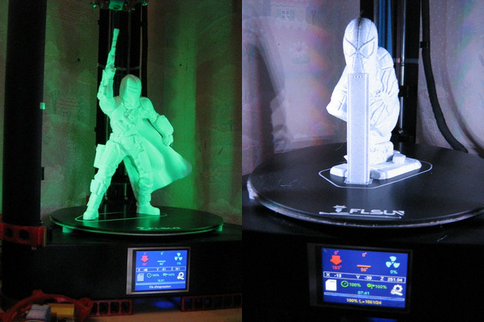
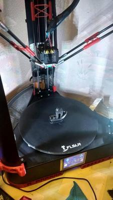
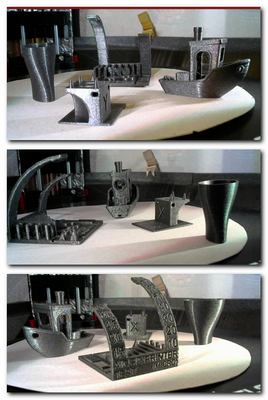
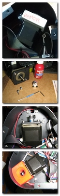
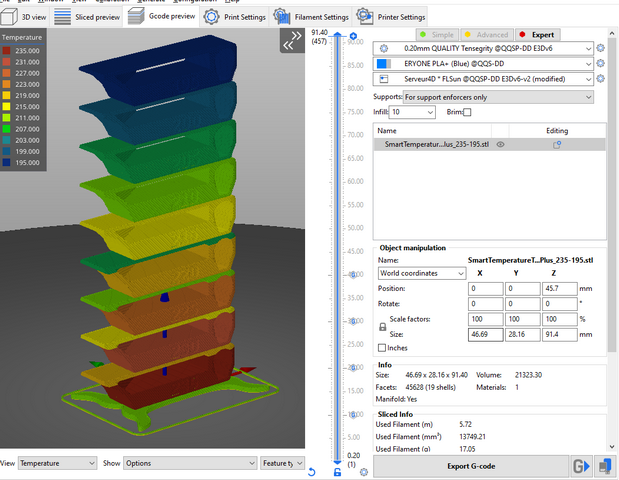
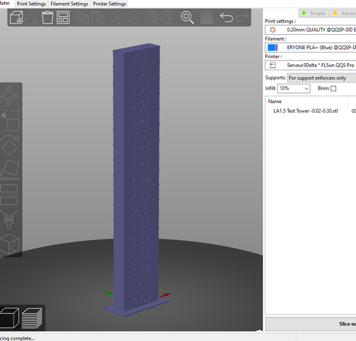

### **TIPS-SLICER** 
  
  In your **Start_GCode** on your Slicer.
  - "M420 S1" enable bed leveling but in my firmware G28 activate the last mesh used or the default one (0)
  - "M420 Lx" or "G29 Lx" (Load mesh_x correction). 
    If you are using PrusaSlicer you can add a line "*G29 Lx; load mesh PLA*" in the **Filament** starting GCode instead of the G29 Lx in the printer start GCode.

  And on my **EndGCode** I remove G28 and I substitute with this type of code:

        {if layer_z <max_print_height} G1 Z {min (layer_z + 100, max_print_height)} {endif} F4000

  This works fine in [PrusaSlicer](https://help.prusa3d.com/en/article/macros_1775) and goes 100cm above the finished object. It's up to you to adapt it for your favorite Slicer or to improve mine.

  ### **You will find some Slicer profiles in the "Slicers" [directory](https://github.com/Foxies-CSTL/Marlin_2.0.x/tree/Firmwares/Slicers).** 

***

📌The print profiles of our printers are included in these slicers by launching the wizard.
Otherwise some "ready to use" profiles are importable.

## 4.1.1 [PrusaSlicer](4.1.Prusa-Slicer)
  
  - [Release](https://github.com/prusa3d/PrusaSlicer/releases)
  - [Wiki](https://github.com/prusa3d/PrusaSlicer/wiki)
  - [F.A.Q](https://help.prusa3d.com/en/article/faq-prusaslicer_1789)

## 4.1.2. SuperSlicer

  - [Release](https://github.com/supermerill/SuperSlicer/releases)
  - [Wiki](https://github.com/supermerill/SuperSlicer/wiki)

## 4.1.3. Others
  
  - [IdeaMaker](https://www.raise3d.com/download/)
  - [Cura](https://ultimaker.com/software/ultimaker-cura)

## 4.1.3. Tests
  
  - 
  
    [Pack-TowerTemp](./tests/TowerTemp-before_layer_change_macro.zip)
  
  -  

     [Pack-KFactor](./tests/KFactor-before_layer_change_macro.zip)

***  
🚸[Go_To_Home](Home)                                   🚸[Go_To_Index](_Sidebar)
***