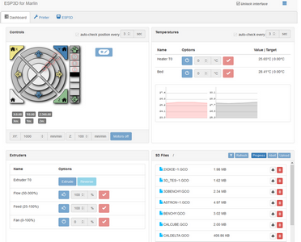
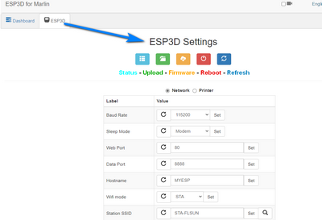
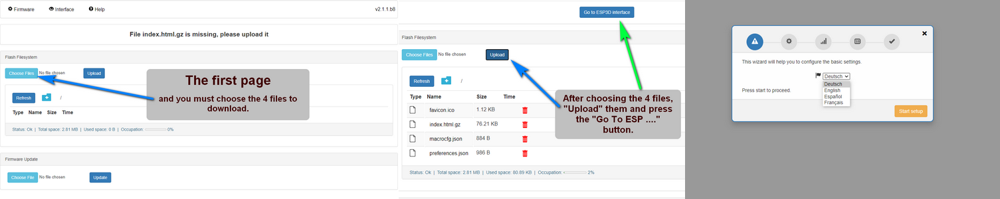

 # For the Wifi Module ESP8266 or Mks Wifi:

[**Wifi Firmwares**](https://github.com/Foxies-CSTL/Marlin_2.0.x/tree/Firmwares/ESP3D)

### Note:
 The ESP3D firmware is compatible with the Mks-Wifi module or a module based on Esp8266 and communicates well with the Marlin firmware. There are two versions of this firmware:
- **Version V2.1** is not compatible with the fast file transfer protocol created by Mks. It is mainly used to have a web interface to control and supervise the printer and the printings in progress. You can also use its built-in terminal to send GCode commands.
- **Version 3.0** is compatible with the Mks file transfer protocol but it requires a screen with a minimum resolution of 480x320 like the Mks TFT35. But this is not enough and it is also necessary to use the graphical interface LVGL of Mks which implements its protocol in the management of the screen.

For information, the QQSPro and Q5 printers use a TFT32 screen which has a resolution of 320x240 and thus these are incompatible with the use of the LVGL interface (Mks).

**_In conclusion, only version 2.1 is compatible with our screens._**

Put the firmware (MksWifi.bin) on the scard with the firmware FLSUN (Robin_mini.bin)
1. Flash original firmware (Robin_mini.bin with Robin_mini_config.txt) + original mkswifi,
2. Look the TFT screen if the update Wifi is effective. 
2. Flash original firmware (Robin_mini.bin with Robin_mini_config.txt) + Custum mkswifi, 
3. Inspect the Wifi Access Point and if you see: AP-FLSUN => Flash ok 
4. Flash the Marlin firmware (Robin_mini.bin), 
5. After that, you can connect to the hotspot AP-FLSUN with password "makerbase"

to run the update of Mks_Wifi or You also can do by web page of the AP (192.168.4.1).

 ### Initial Configuration after the flash.

1. Open device web page on the AP connected device (ap:AP-FLSUN/pwd:makerbase)
2. Accept Captive portal redirect or Open a web browser and navigate to http://192.168.4.1
3. Upload 4 files in the directory "FilesToUpload' and configure the device to your choosing.
4. I recommend changing to **Station mode** and connecting to your home/office Wifi instead of staying in AP mode
5. You may want to change the Baud rate to accord with your printer.
6. You can change to DHCP, or at the very least setup a Static IP you are familiar with.

Once reconnected to the module's web page, you can update it through the interface with:
 - New files "index.html.gz", "preferences.json" or "macros"
 - A new ESP firmware "MksWifi.bin or" ESP_firmware.bin "

Enjoy....🙃

More information: [ESP3Dv2.1](https://github.com/luc-github/ESP3D/wiki/Install-Instructions)

# Version history
## Marlin 2.0 Bugfix Branch
 Update ESP3D 20210513 
  - Last release v2.1.1b10,
  - Last release v3.0alpha.

## Marlin 2.0 Bugfix Branch
 Update ESP3D 20201213 
  - Last release v2.1.1b8,

## Marlin 2.0.7 
 Update ESP3D 20201001 
  - Last release v2.1.0,

***  
🚸[Go_To_Home](Home)                                   🚸[Go_To_Index](_Sidebar)
***