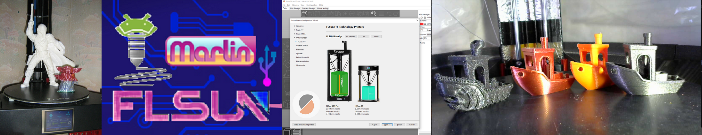

### Here are some of the things I've done as I've improved my beautiful Delta QQS-Pro.

*** 
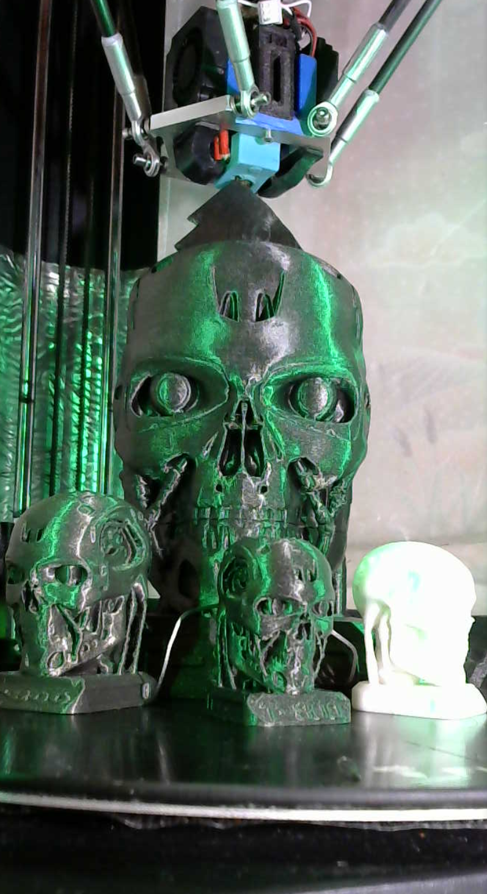
[Terminator](https://www.thingiverse.com/thing:4703101)

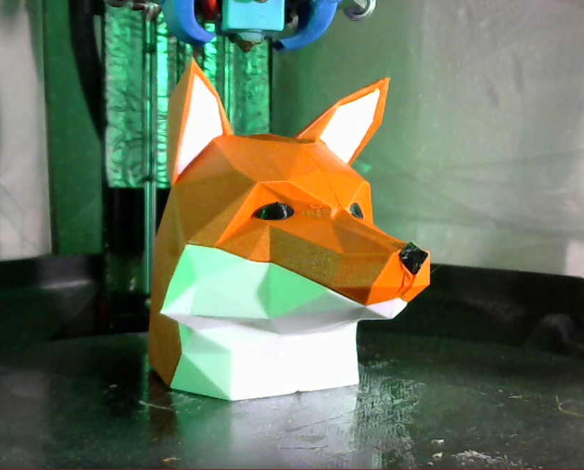
[Fox Head Orlinsky](https://www.thingiverse.com/thing:4675626)

[SpiderMan](https://www.thingiverse.com/thing:4543803)

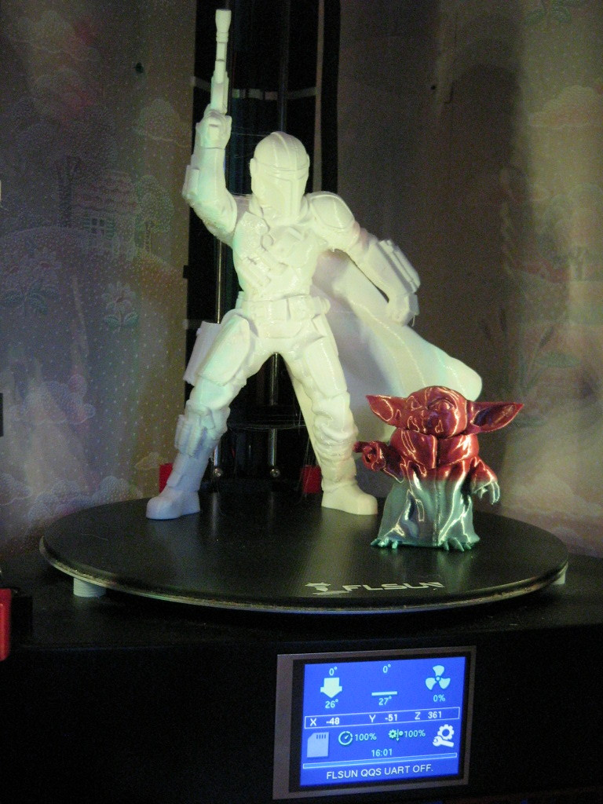
[Mandalorian&Grogu](https://www.thingiverse.com/thing:4622798)

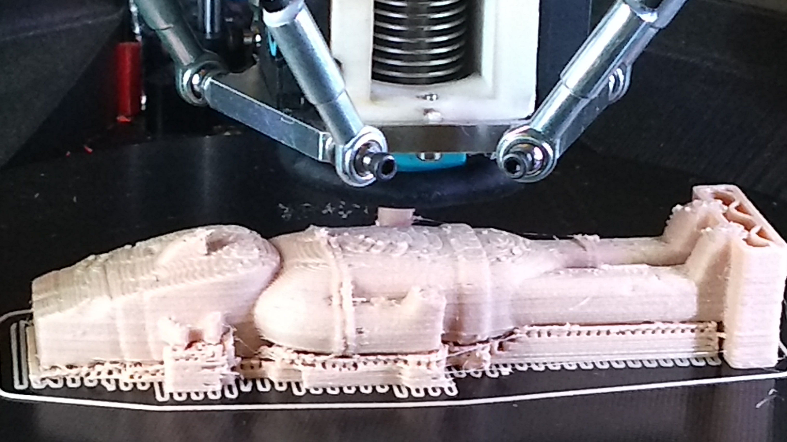
[Tintin-BrokenEar](https://www.myminifactory.com/object/3d-print-tintin-the-broken-ear-arumbaya-statue-14395)

***
[Captain America](https://www.thingiverse.com/thing:4543791)

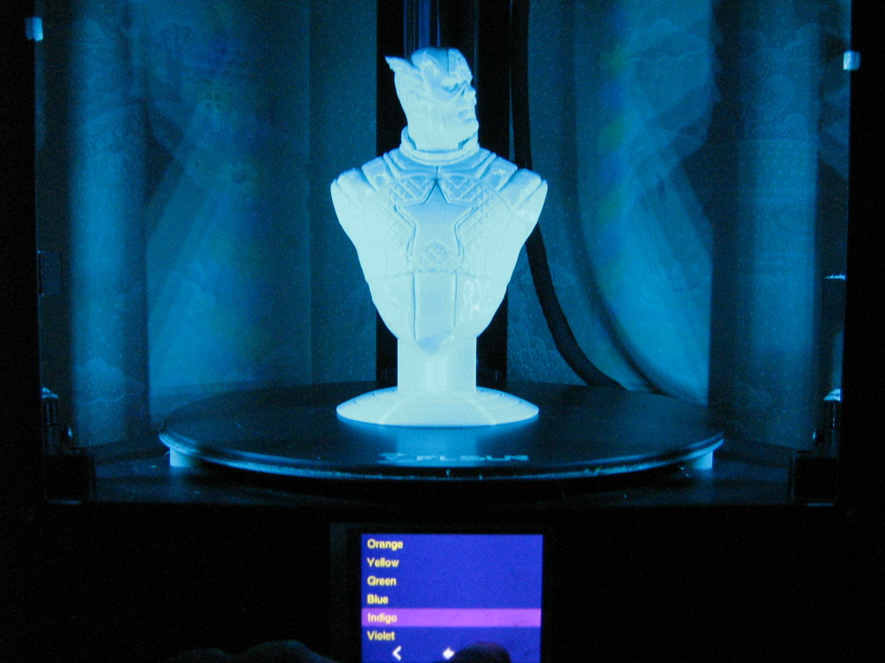
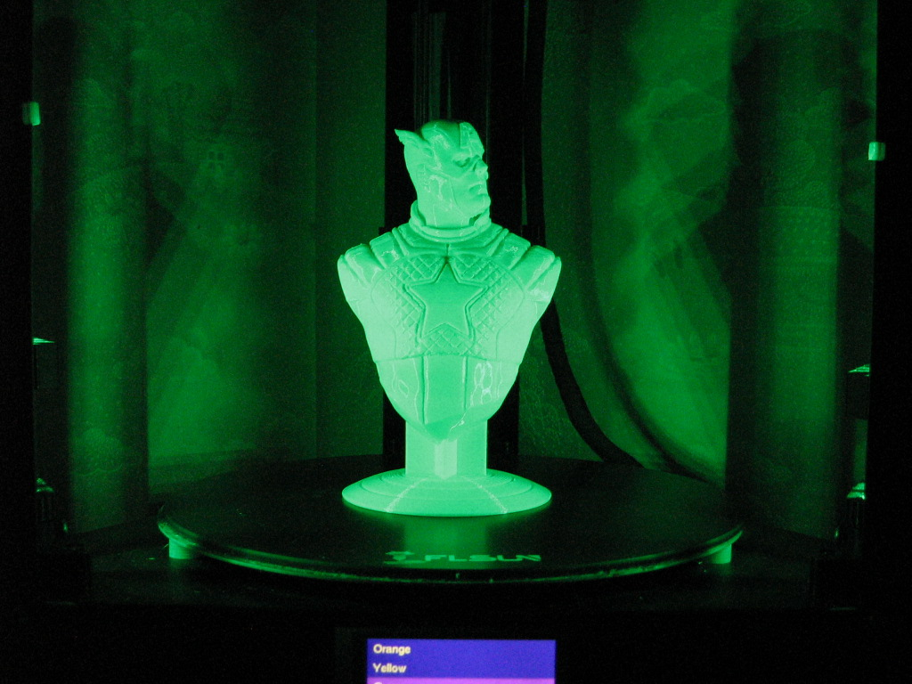
***
[Supports Enclosure](https://www.thingiverse.com/thing:4345354)
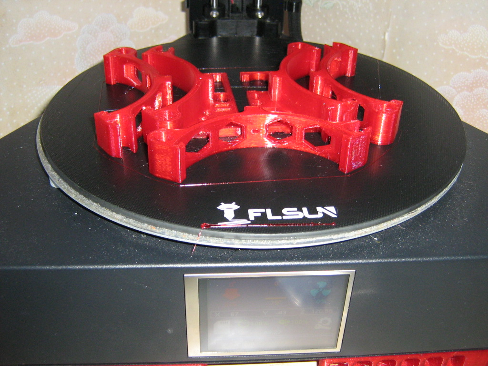
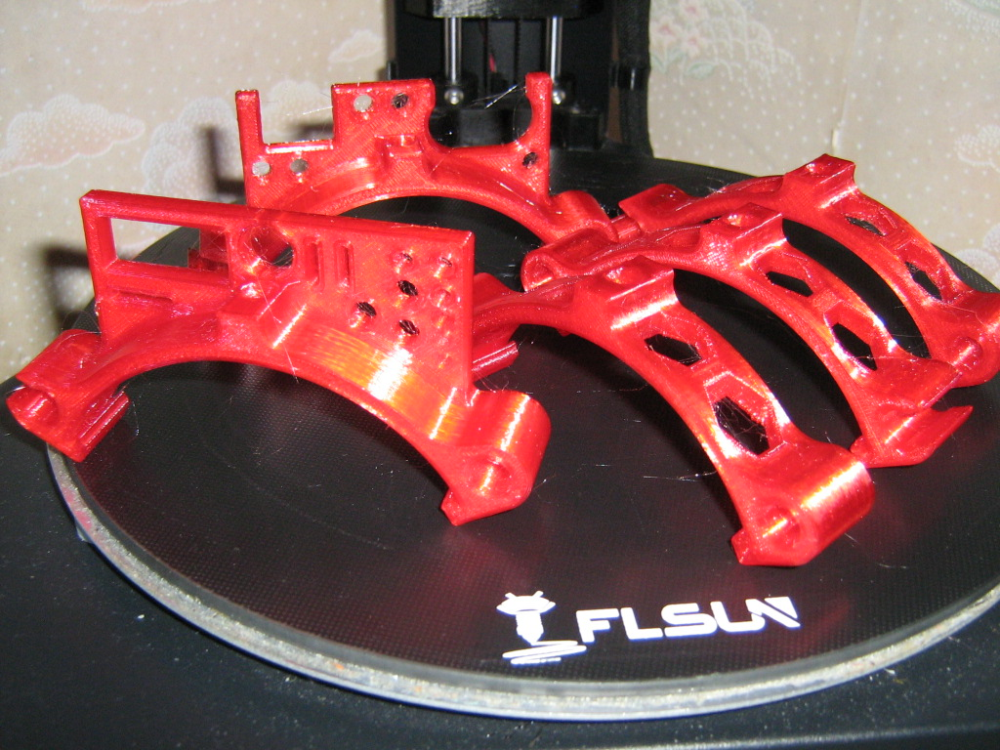

***
[Some Test Print]()
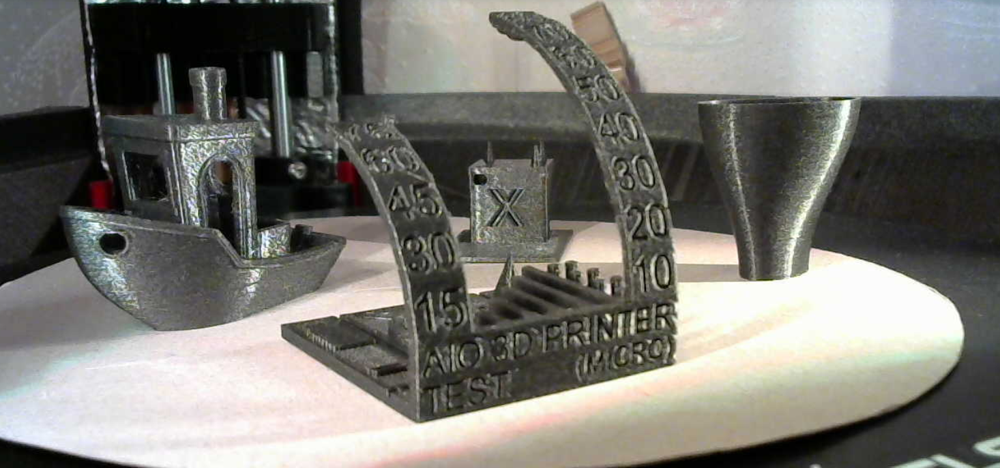
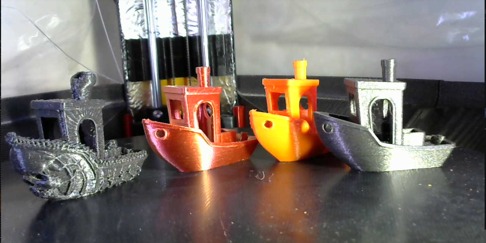
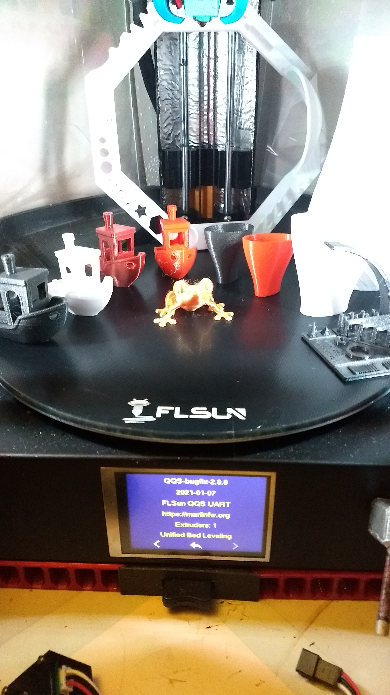

***
[Electronics Lab](https://www.thingiverse.com/thing:2999383)
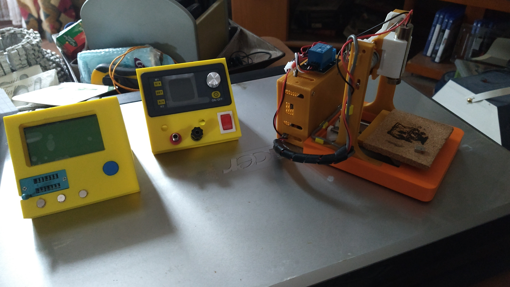

***

[Go_To_Home](Home)                                   [Go_To_Index](_Sidebar)