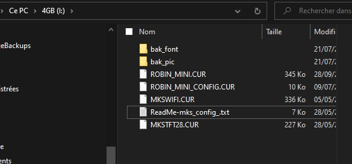

📌
## 7.1. **Marlin vs Klipper**

Klipper and Marlin are being compared more and more:

Klipper is often cited for its printing speed with good quality, but its implementation is difficult for a beginner. 
Moreover, you need a RaspBerry to use it,
- you lose control of your main screen,
- it requires a good knowledge of macro-command programming,
- to have a good base on networks.
- the link between your board and the raspberry is always limited to USB and these connection problems.
There is no "plug and play" configuration because everyone has configured his printer by hand.

So to be reserved for **advanced users**.

As for Marlin, it is "Plug and Play". Of course you will go slower (<120mm/s) but the quality will **only depend** on your slicer settings.

# Another advantage of **Marlin** is that all settings are accessible through the advanced menu and in **REAL TIME**:
## 7.1.1 MENUS
- Speed, acceleration, jerk, temp, ....

- filament flow, linear feed, filament loading and unloading length,

- Setting of currents and threshold of TMC stepper drivers (UART mode)

- 🌐Change the language of your country (5 choices: English, French, German, Spanish, Italian),

- Light control if you have put a NeoPixels led strip.

- and more ;-) 

## 7.2. **Delta printer**

- Calibration:

  FYI:The iterations correspond to the precision and stability of the measurements. The more iterations you have, the more it shows that your machine is a bit too flexible. The progression of iterations stops when the set of different measurements in the sequence (iteration) does not decrease anymore. This is called the standard deviation (std dev.)
  For the calibration of the dimensions, it is necessary to do it after a good calibration and not to move the machine, tighten its belts or redo a calibration because it will cancel all your adjustments.

## 7.3. **Hardware**

### 7.3.1 Stepper Drivers:

  To adjust the Vref of your TMCs, you must have the characteristics of your stepper motor (its operating current per phase (Imax). 
  From there, you will be able to adjust your Vref very quickly.

  Some users say:

  _"My print skips steps..."_

  _"My extruder motor is very hot ..."_
  
  _"My print pauses but never in the same place"_ 
  
  _"I put in TMC220x and my stepper motors always make noise"_
  
  .....

  Yes, this is why it is necessary to adjust the Vref so that it is in accordance with the maximum and effective torque of the stepper motor.
  For TMC=Vref=Inom Stepper Motor.
  ex: stepper motor= 1.5A, Inom = 1.06A.

  **Underpowered**, it will lose its torque and may even vibrate without being able to keep its stable position.

  **Supercharged**, it will make a lot of noise by resonance and of course overheat (the stepper driver also on the other hand reactions).

- **📌Note on LIN_ADVANCE and TMC2208**
_(Thanks to John D. for this comment)_

  In linear feed mode, the Marlin firmware generates a large number of short step pulses outside of the step interruption. This can disrupt the TMC2208 (depending on the TMC builder) on the extruder and cause the extruder driver to shut down and the stepper motor to effectively shut down. While it is theoretically possible to optimize the software to account for this, it would require a significant rewrite of the planer code. A potential solution for this is to connect the UART port to adjust it in real time and increase the HYBRID_THRESHOLD value to have a wider range of speeds in StealthChop mode (50 vs 30 in my firmware). This might not work, so a better solution is to use the TMC2209 module.

### 7.3.2 🔧Update and flash:

  To perform a good update of your printer, follow these tips:
  - use an SDCard of less than 16GB (some advanced users may compartmentalize their card)
  - Format your SD card in FAT32 mode but with clusters of 4096 or 2048.
  - Place all your firmware files (Board or TFT) at the root of your card :
    - **Marlin:**
    - Q5 = Robin_nano.bin
    - QQS = Robin_mini.bin
    - SKR board = firmware.bin
    - MKS board nanov3 = Robin_nano_v3.bin
    - **FLSUN:**
    - Q5 = Robin_nano.bin + Robin_nano_config.txt + drawers fonts and pictures (picture). 
    - QQS = Robin_mini.bin + Robin_mini_config.txt + drawers fonts and pictures (picture).

  - Turn off your printer, insert the SD card, turn on ...... and the procedure will run automatically.
  - Recover your SD card and check on your computer that certain files have been renamed with the ".CUR" extension. If this is the case, your operation was successful.
  
  After the update is done and the files are renamed in capital letters with the extension ".CUR"., it is possible to reuse them again. To do so, change the extension of the element(s) to the pre-update extension (.bin or .txt) and start the update process again.
  
  - example for a QQS or a Q5 Stock : Before UPDATE / After UPDATE.

  
  

### 7.3.3 📺Reset TFT screen (BTT TFT screen):

  Put on your SD card a text file named "reset" with the file-extension "txt. Place in your printer and power on your TFT screen.

### 7.3.4 RaspBerry:

  rpi-serial-console

  Link to explanation [Connection_SERIAL](https://elinux.org/RPi_Serial_Connection#S.2FW:_Preventing_Linux_from_using_the_serial_port)

### 7.3.5 Wiring of the effector part.

Here is the wiring of the whole effector of a QQS-Pro printer.

## 7.4.🔨Build your own firmware: (Prefer the stable **FLSUN** branch on my GitHub)
    
1- Download VSC (VisualStudioCode), run the installation and after add the Platformio extension and install it. 

2- Download the ZIP pack of the latest Marlin 2.0.9 release (.zip) or my latest release for QQS. Unzip it wherever you prefer. 

3- Go to VSC and load Platformio (PIO Home) and declare by "Quick Access" a new "open project", then choose the Marlin directory you have unzipped. 

4- On the vertical banner on the left of the window, choose the first icon (Explore). You have a file architecture that corresponds to your previously unzipped directory. Choose the file platformio.ini which is the starting point of a compilation. 

5- Define the used environment for example "env = flsun_hispeedv1" for the QQS-Pro or "env = robin_nano35" for Q5.

 

6- Modify the file FLSUNQ_Config.h to add/modify/remove other parameters (read the comments to enable or disable the functions)

7- Start the creation of your firmware by clicking on the "V" icon at the bottom of the VSC window.

8-📦️If you succeeded (result message in green), you will find the firmware in the directory "dot.pio/build/hispeedv1/Robin_mini.bin" at the root of the source directory.

## 7.5. **Slicer**

  Resume printing for multiple files => merge it into one and rename with max 22characters name.

- Problem with SD card recovery: 

  If the SD card isn't fast enough to write the recovery PLR file.
  **Prefer a Class10 card.**

  You can enable or disable this feature by menu (Configuration/PowerOutage) or by command "M413 S0"

- PAUSE with PrusaSlicer:

  The pause works great on Marlin and not just the filament change (M600). 
  By the menu or by the slicer by inserting the GCodes "M1 click to continue" or "M125 L2" (Pause Park and retract 2mm)

  M125 [L<linear>] [P<bool>] [X<linear>] [Y<linear>] [Z<linear>]

For users who print by SD card, you insert M25 (Pause SD Print)

info links:

  Command [M125](https://marlinfw.org/docs/gcode/M125.html)

  Command [M25](https://marlinfw.org/docs/gcode/M025.html)

  

- Another tip for the user who does not use Octoprint but the Mks_Wifi module to send these print files to the printer.
You can use this script with PrusaSlicer, "Print Settings" tab, "Output Options" field "Post processing".

The link and all the info => [MKS-WIFI_PS](https://github.com/ArtificalSUN/MKS-WIFI_PS_uploader#readme)

## 7.6.🥅The leveling:

  Some people add the command "M420 S1" after the command G29. 
  This command is often used with the ABL leveling mode and allows to activate the bed level correction. In fact, it is used to memorize in slot "1", the mesh made by G29. 
  
  In my firmware we use the UBL leveling mode, the bed correction is activated as soon as we make a G28 with the last used mesh.
  
  To load/change the mesh we are going to use, we use the command G29 L(0/1/2/3). 
  
  Either we put it in the general start GCode (Cura/Prusa) or in the filament start GCode (Prusa).
  This is more logical because it corresponds to the choice of filament used (PLA, PETG, ABS, TPU, ....).

  **📌Note:**
  The leveling of the mesh bed is based on the SQUARE and we have a CIRCLE so we will always be missing inaccessible points. That's why we fill these points with values identical to the closest values of these points.
  
  Example: 8 points mesh on my firmware => 8x8 = 64 points (square) but only 32 points can be used/probed. 
  
  if you choose 10 points mesh, you have 10x10= 100points(square)= 53points (circle).

  

## 7.7 Finishing touch✨

- ======♻️======PLA=========♻️========
  
  Smooth with methylene chloride.
  ### Methylene chloride is highly toxic, 
  **Be sure to read the instructions before using this chemical.** 

- ======♻️======ABS=========♻️========
  
  Smooth with Acetone.
  ### ACETONE vapors are toxic, 
  **Be sure to read the instructions before using this chemical.**

***
🚸[Go_To_Home](Home)                                   🚸[Go_To_Index](_Sidebar)
***
