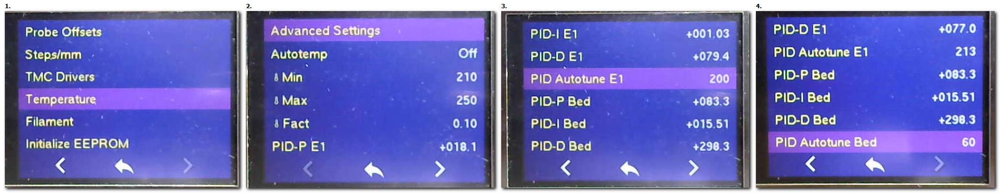

## 7.1. **Marlin vs Klipper**

Klipper and Marlin are being compared more and more:

Klipper is often cited for its printing speed with good quality, but its implementation is difficult for a beginner. 
Moreover, you need a RaspBerry to use it,
- you lose control of your main screen,
- it requires a good knowledge of macro-command programming,
- to have a good base on networks.
- the link between your board and the raspberry is always limited to USB and these connection problems.
There is no "plug and play" configuration because everyone has configured his printer by hand.

So to be reserved for **advanced users**.

As for Marlin, it is "Plug and Play". Of course you will go slower (<120mm/s) but the quality will **only depend** on your slicer settings.

# Another advantage of **Marlin** is that all settings are accessible through the advanced menu and in **REAL TIME**:
- Speed, acceleration, jerk, temp, ....

- filament flow, linear feed, filament loading and unloading length,

- Setting of currents and threshold of TMC stepper drivers (UART mode)

- Change the language of ulitisation (5 choices),
- Light control if you have put a NeoPixels led strip.
- and more ;-) 

## 7.2. **Delta printer**

Calibration:
FYI: The iterations correspond to the precision and stability of the measurements. The more iterations you have, the more it shows that your machine is a bit too flexible. The progression of iterations stops when the set of different measurements in the sequence (iteration) does not decrease anymore. This is called the standard deviation (std dev.)
For the calibration of the dimensions, it is necessary to do it after a good calibration and not to move the machine, tighten its belts or redo a calibration because it will cancel all your adjustments.

## 7.3. **Hardware**

## 7.4. **Slicer**

PrusaSlicer:
Resume printing for multiple files =>merge it into one and rename with max 22characters name.

Problem with SD card recovery: If the SD card is not fast enough to write the recovery PLR file.
Prefer a Class10 card.

Pause while printing: use GCode="M1 click to continue" or "M125 L2" to insert ("+" click right) in your PrusaSlicer print progress scale.

## 7.5 Finishing touch

============PLA=================
Smooth with methylene chloride.
### Methylene chloride is highly toxic, 
**Be sure to read the instructions before using this chemical.** 

============ABS=================
Smooth with Acetone.
### ACETONE vapors are toxic, 
**Be sure to read the instructions before using this chemical.** 

