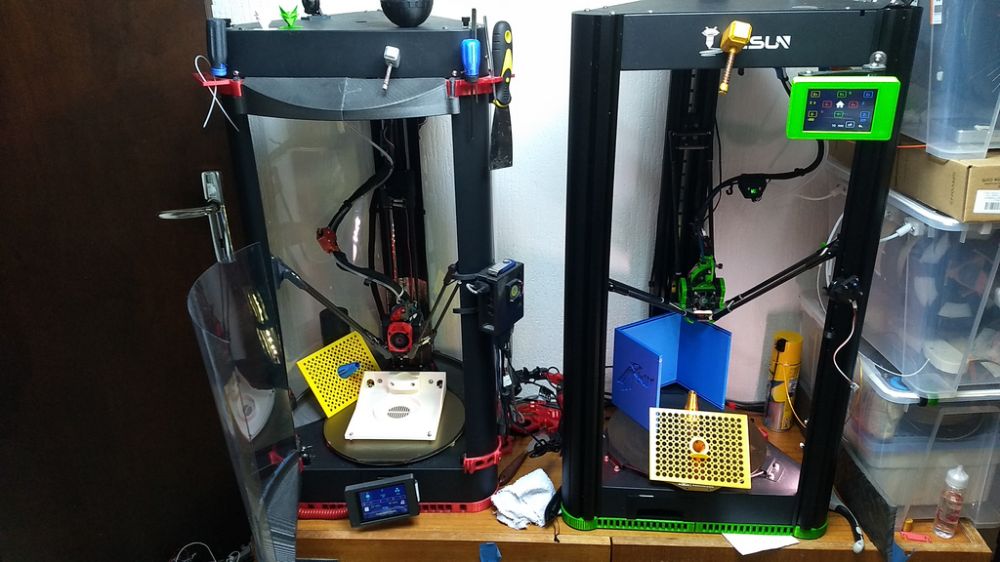
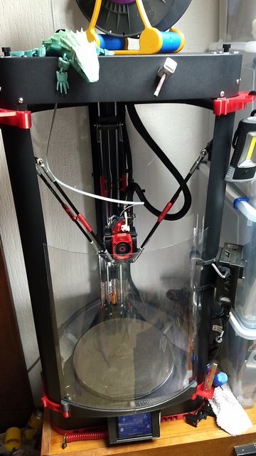
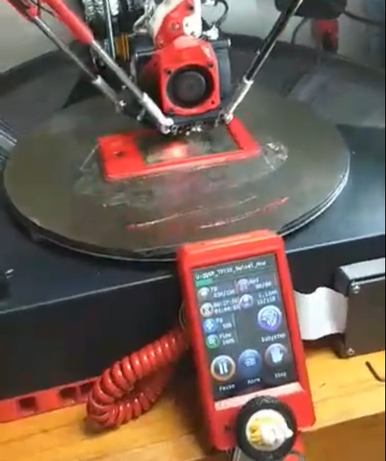
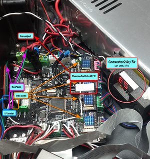
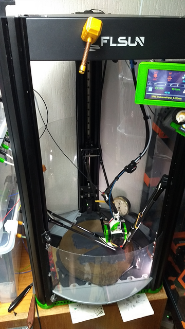
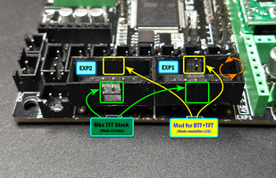

# My QQS Pro printer acquired in July 2020.

Current config: 
- Firmware Marlin (the last) full 32steps,
- 3xTMC2209UART+1xTMC2226 one wire,
- TFT screen TFT35 with COLOR UI, 
- extruder DirectDrive (SDHX), 
- custom effector with house-case (ABS), 
- bloc hotend Volcano 0.4/0.6 nozzle with 50W cartridge.
- probe/sensor fixed,
- 24 leds strip Neopixel managed by the firmware
- full enclosure for special filaments,
- PEI bed,
- ...

Here are the main modifications to stabilize the structure and improve the printing.

- Mechanics:
  -  larger bearing of the sliders,
  -  replacement of GT2x8mm reinforced belts.
 
- Electrical:
  - 300W PowerSupply,
  - Converter 24v/5v (NeoPixel-leds/TFT_Screen).
       
  - LedStrip (18) on B tower.
- Electronic:
  - 3xTMC2209Uart+1xTMC2226(E0),
  - addition of a cooling channel, (PETG) with a 40°C thermoswitch, to start the fan output.
    

- Additional modules:
  - IR probe/BDS sensor fixed,

# My SR printer acquired in December 2021.

Current config: 
- Firmware Marlin (the last) full 32steps,
- 4xTMC2226 UART, 
- TFT screen TS35R with COLOR UI,
- extruder DirectDrive (SDHX),
- custom effector with house-case (ABS),
- bloc hotend Volcano 0.4/0.6 nozzle CHT with 70W cartridge,
- probe/sensor fixed,
- 48 leds strip Neopixel managed by the firmware,
- coolfan mobo for TMC managed by the firmware,
- demi-enclosure for special filaments,
- PEI bed,
- ...

Here are the main modifications to stabilize the structure and improve the printing.

 - Mechanics:
   - added an ABS reinforcement and changed the pulley idler shaft.

 - Electrical:
   - 500W PowerSupply,
   - Converter 24v/5v (NeoPixel-leds),
   - added an insulation plate between the base of the bed and the power supply,
   - added a 40°C thermoswitch to start the fan of the power supply.

 - Electronic:
   - 4xTMC2226,
   - addition of a CMOS module in the free place of the 2nd driver of the stepper motor E1,
   - TFT Mks-TS35v2 or BTT-TFT35v3
    

 - Additional modules:
   - added one output 24v with switch for Sunlu S1,
   - addition of a cooling channel with a thermistor (E1) on the TMC with a fan controlled by the second output E1 (firmware),
   - installation of a pump for the air flow (BerdAir),
   - replacement of the stock cable by two spiral cables (PowerSupply-Accessories+MotorStepper E0),
   - added 3xLeds on effector,
   - IR probe/BSD sensor fixed,
   - General connection plate on the end effector.
